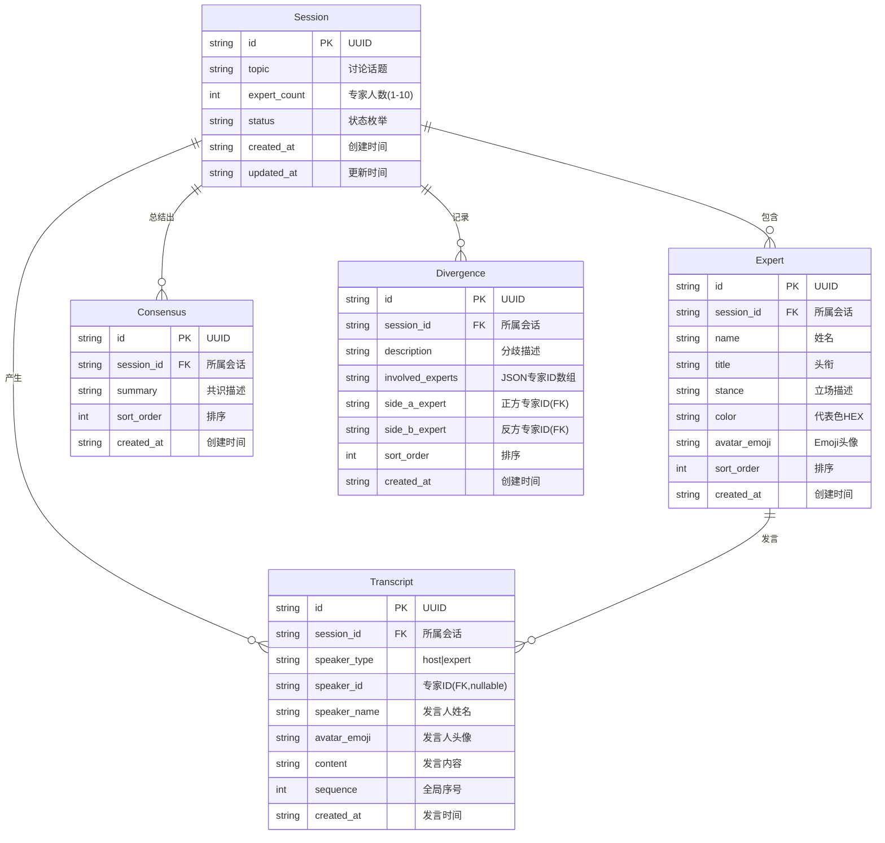

# AI 圆桌讨论 — ER 图

## Mermaid ER 图

## 实体列表（Markdown 表格 + 关系描述）

  实体列表

  ┌────────────┬────────────────────────┬─────────────────────────────────────────────────────────────────────────┐
  │    实体    │          描述          │                                核心字段                                 │
  ├────────────┼────────────────────────┼─────────────────────────────────────────────────────────────────────────┤
  │ Session    │ 一次圆桌讨论会话       │ id, topic, expert_count, status, created_at                             │
  ├────────────┼────────────────────────┼─────────────────────────────────────────────────────────────────────────┤
  │ Expert     │ 参与讨论的「虚拟专家」 │ id, session_id, name, title, stance, color, avatar_emoji                │
  ├────────────┼────────────────────────┼─────────────────────────────────────────────────────────────────────────┤
  │ Transcript │ 单条发言记录           │ id, session_id, speaker_id, speaker_type, content, sequence, created_at │
  ├────────────┼────────────────────────┼─────────────────────────────────────────────────────────────────────────┤
  │ Consensus  │ 达成的共识点           │ id, session_id, summary, created_at                                     │
  ├────────────┼────────────────────────┼─────────────────────────────────────────────────────────────────────────┤
  │ Divergence │ 记录的分歧点           │ id, session_id, description, involved_experts, created_at               │
  └────────────┴────────────────────────┴─────────────────────────────────────────────────────────────────────────┘

  关系矩阵

  ┌─────────┬──────────┬────────────┬─────────────────────────────────────────────────────┐
  │  左端   │   关系   │    右端    │                        说明                         │
  ├─────────┼──────────┼────────────┼─────────────────────────────────────────────────────┤
  │ Session │ 1 ──── N │ Expert     │ 一个讨论会话有 N 位专家，Session 删除时级联清除专家 │
  ├─────────┼──────────┼────────────┼─────────────────────────────────────────────────────┤
  │ Session │ 1 ──── N │ Transcript │ 讨论过程产生 N 条发言记录，按 sequence 有序排列     │
  ├─────────┼──────────┼────────────┼─────────────────────────────────────────────────────┤
  │ Session │ 1 ──── N │ Consensus  │ 讨论结束后汇集 0~N 条共识要点                       │
  ├─────────┼──────────┼────────────┼─────────────────────────────────────────────────────┤
  │ Session │ 1 ──── N │ Divergence │ 讨论结束后汇集 0~N 条分歧要点                       │
  ├─────────┼──────────┼────────────┼─────────────────────────────────────────────────────┤
  │ Expert  │ 1 ──── N │ Transcript │ 每位专家发言 0~N 次；Host 发言时 speaker_id 为空    │
  └─────────┴──────────┴────────────┴─────────────────────────────────────────────────────┘

  关系图（文字版）

    ┌──────────┐          ┌────────────┐
    │ Consensus│◄─────────┤            │
    ├──────────┤ 0..N     │   Session  │
    │ summary  │          │            │
    └──────────┘          ├────────────┤
                          │ id         │
    ┌──────────┐          │ topic      │
    │Divergence│◄─────────┤ expert_cnt │
    ├──────────┤ 0..N     │ status     │
    │ desc     │          │ created_at │
    │ involved │          └─────┬──────┘
    └──────────┘                │
                       ┌────────┴────────┐
                       │                 │
                  ┌────▼─────┐   ┌──────▼──────┐
                  │  Expert  │    │ Transcript  │
                  ├──────────┤    ├─────────────┤
                  │ name     │    │ sequence    │
                  │ title    │    │ speaker_type│
                  │ stance   │    │ content     │
                  │ color    │◄───│ speaker_id  │
                  │ avatar   │ N  │ speaker_name│
                  └──────────┘    └─────────────┘
                  